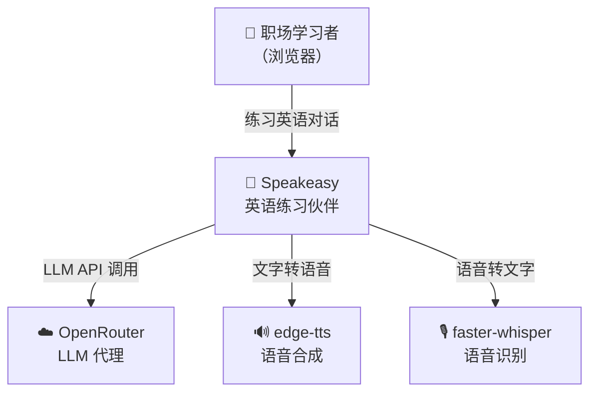
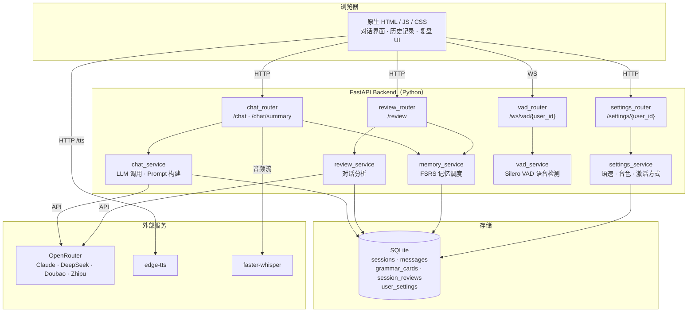
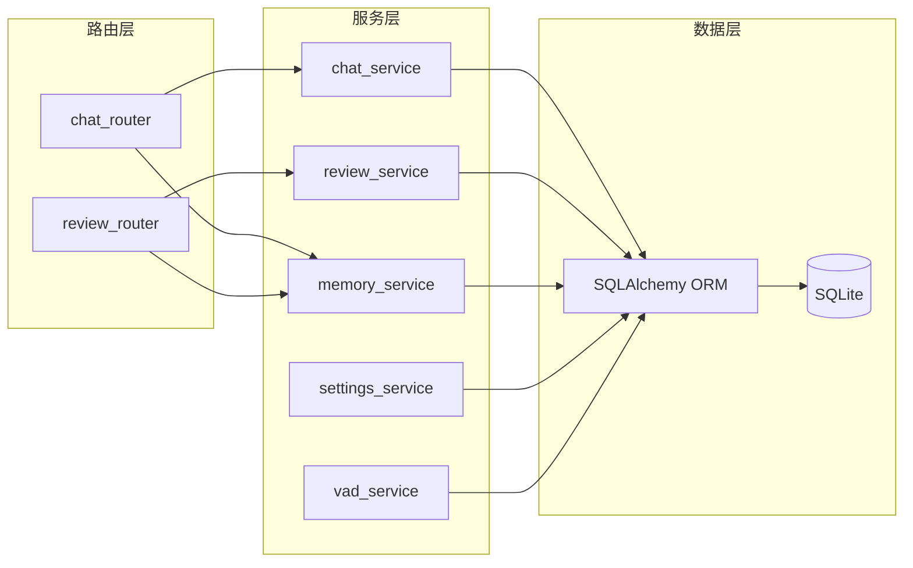

# Speakeasy 架构图（C4 Model）

> 维护规则：每次新增或删除模块时由 Claude Code 更新此文件
> 最后更新：V0.3.1

---

## Level 1 — System Context（系统边界）

---

## Level 2 — Container（模块组成）

---

## Level 3 — Component（Backend 内部）

---

## 变更记录

| 版本 | 变更内容 |
|---|---|
| V0.1 | 初始：Frontend + ChatRouter + ChatService + SQLite |
| V0.2a | 新增：STT / TTS 外部服务接入 |
| V0.2b | 新增：ReviewRouter · ReviewService · MemoryService · grammar_cards 表 · session_reviews 表 |
| V0.3.1 | 新增：SettingsRouter · SettingsService · VADRouter · VADService · user_settings 表 |

---

## 功能流程文档索引

| 流程 | 文件 | 说明 |
|---|---|---|
| 记忆调度 | [memory-flow.md](flows/memory-flow.md) | FSRS 卡片完整生命周期 |
| 对话复盘 | [review-flow.md](flows/review-flow.md) | 复盘生成、评分、历史访问 |
| 主对话   | [chat-flow.md](flows/chat-flow.md) | 消息处理、记忆注入、多模型路由 |
| 用户设置 | [settings-flow.md](flows/settings-flow.md) | 语速·音色·激活方式保存与TTS集成 |
| VAD检测  | [vad-flow.md](flows/vad-flow.md) | 实时语音检测、误触处理 |