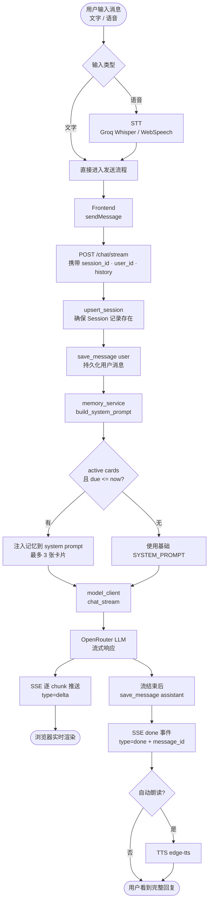
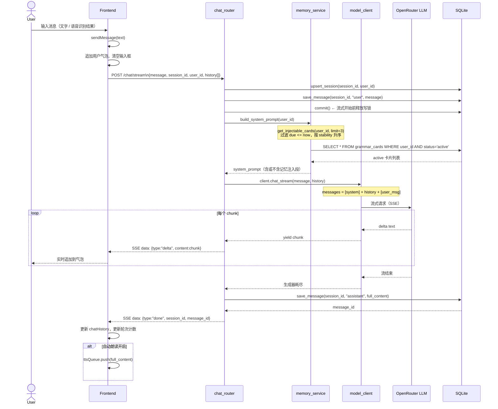
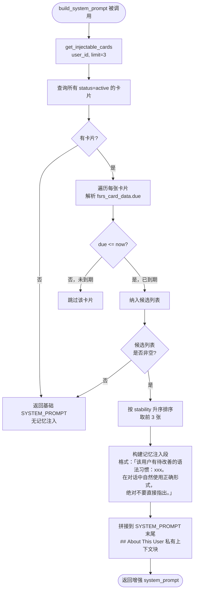
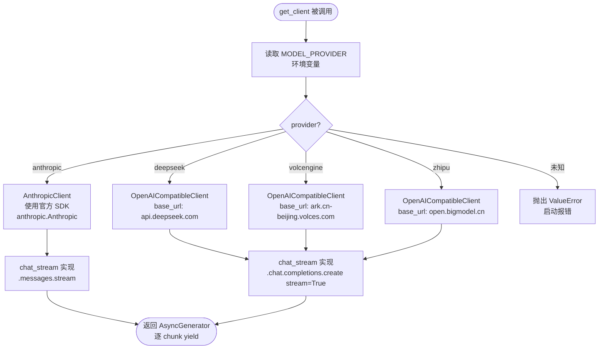

# 主对话流程（Chat Flow）

> 描述：从用户发送消息到 Alex 流式回复的完整数据流，含记忆注入与多模型路由
> 涉及模块：chat_router · memory_service · model_client · sessions 表 · messages 表 · grammar_cards 表
> 最后更新：V0.2b

---

## 一、全局流程概览



---

## 二、主对话完整时序



---

## 三、System Prompt 构建逻辑



**注入限制**：
- 注入上限：最多 3 张（`limit=3`）
- 注入条件：`due <= now`（卡片已到期）
- 排序：`stability` 升序（优先注入最不稳定的记忆）
- 隐私保护：注入段标注"绝对不要直接提及"，Alex 只能以自然方式示范正确用法

---

## 四、多模型路由逻辑



**共同配置**：
- `timeout=30.0`
- `http_client=httpx.Client(trust_env=False)` — 忽略系统代理
- `MODEL_NAME` 由 `MODEL_NAME` 环境变量决定，默认见 `app/config.py`

---

## 五、会话管理逻辑

```mermaid
flowchart TD
    A([页面加载]) --> B[getUserId\nlocalStorage uuid]
    B --> C[getSessionId\nlocalStorage uuid]
    C --> D[loadHistory\nGET /history/{user_id}]
    D --> E[渲染历史侧边栏]

    F([用户查看历史会话]) --> G[onHistoryClick\nsid]
    G --> H[GET /history/{sid}/messages]
    H --> I[renderReadonlyChat\nsetMode readonly]
    I --> J[GET /review/{sid}]
    J --> K{200?}
    K -->|是| L[showReviewBtn\nheader-right 插入按钮]
    K -->|否| M[hideReviewBtn\n静默]

    N([用户点「新对话」]) --> O[onNewChat]
    O --> P[newSession\n生成新 uuid]
    P --> Q[重置 chatHistory · _roundCount]
    Q --> R[hideReviewBtn + resetEndBtn]
    R --> S[Alex 发开场白]

    T([用户点「← 回到当前对话」]) --> U[returnToCurrentSession]
    U --> V[恢复 DOM 快照]
    V --> W[hideReviewBtn + resetEndBtn]
    W --> X[setMode chat]
```

---

## 六、关键数据结构

**`/chat/stream` 请求体**：

```json
{
  "message": "I go to office yesterday",
  "session_id": "uuid-string",
  "user_id": "uuid-string",
  "history": [
    {"role": "user",      "content": "..."},
    {"role": "assistant", "content": "..."}
  ]
}
```

**SSE 事件类型**：

```
data: {"type": "delta",  "content": "Hey! "}
data: {"type": "delta",  "content": "That sounds"}
data: {"type": "done",   "session_id": "...", "message_id": 42}
data: {"type": "error",  "message": "..."}
```

**sessions 表**：

```
id          TEXT PK  (uuid)
user_id     TEXT
preview     TEXT     (侧边栏预览，首条用户消息前 40 字符)
created_at  DATETIME
```

**messages 表**：

```
id          INT PK (autoincrement)
session_id  TEXT FK → sessions.id
role        TEXT  ('user' | 'assistant')
content     TEXT
created_at  DATETIME
```
