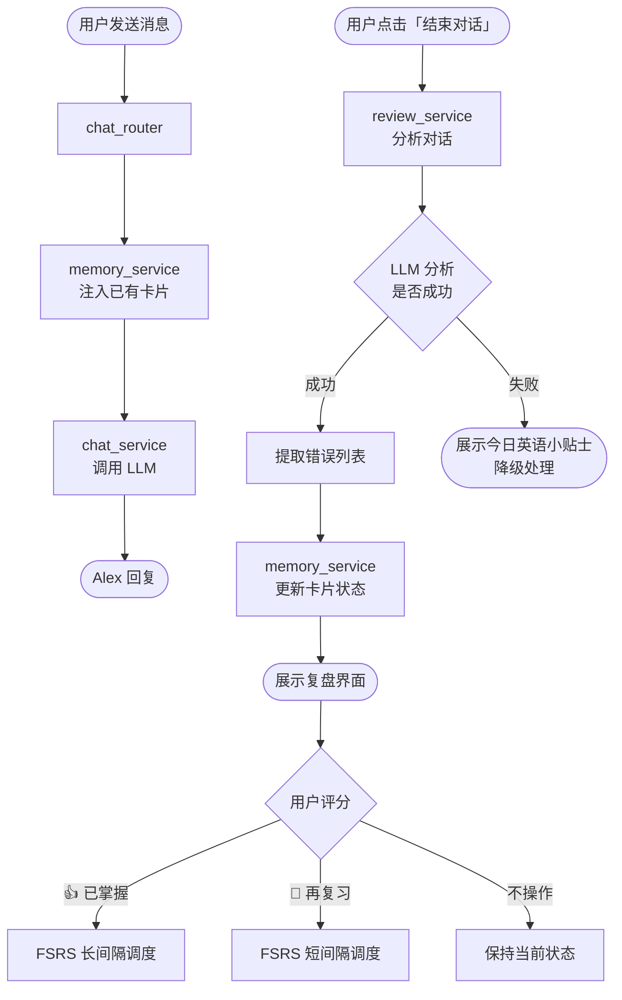
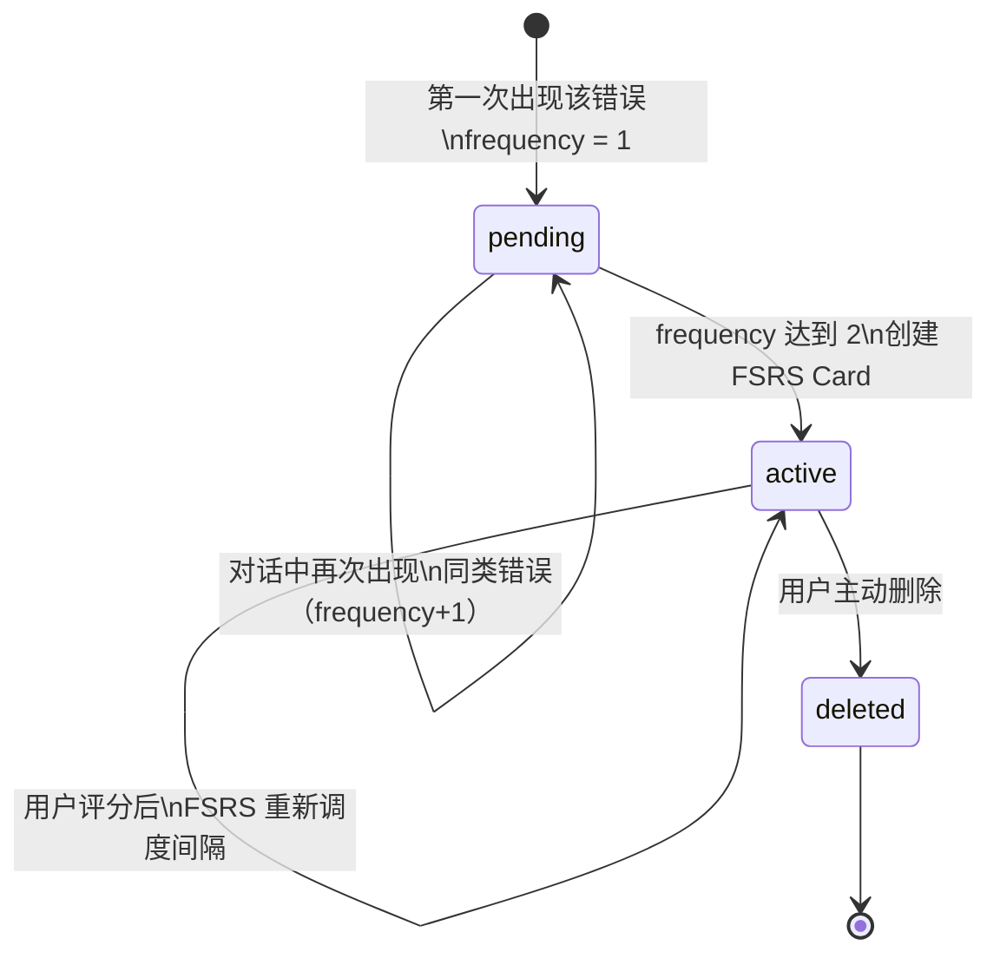
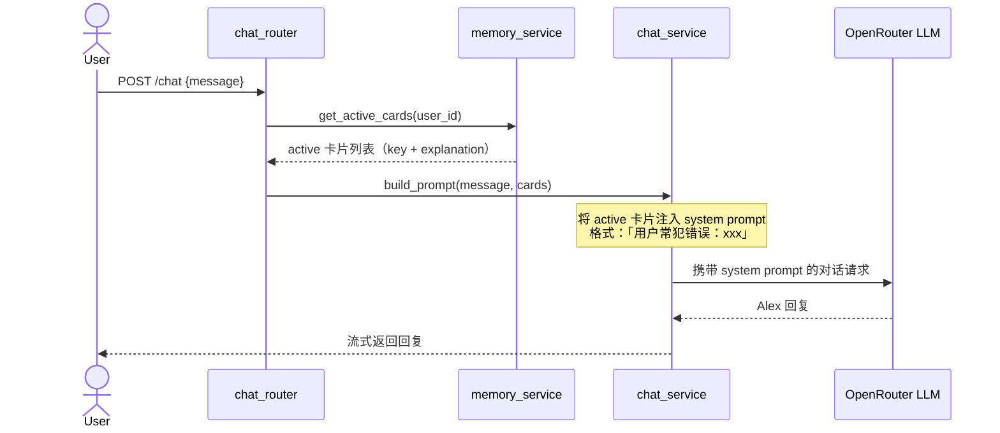
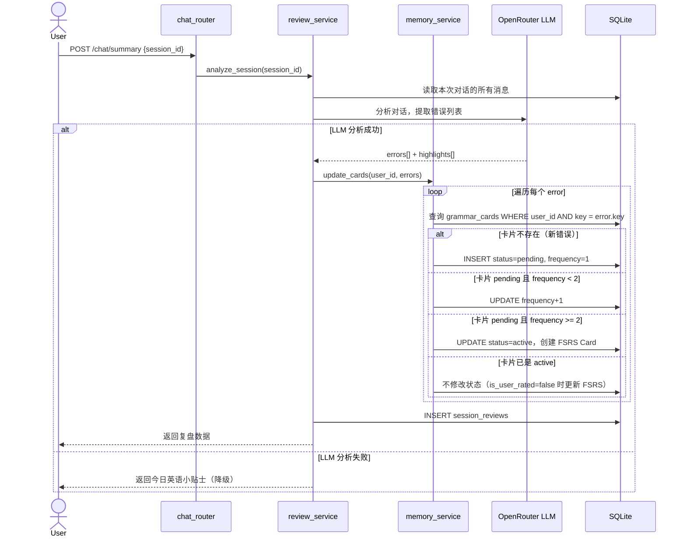
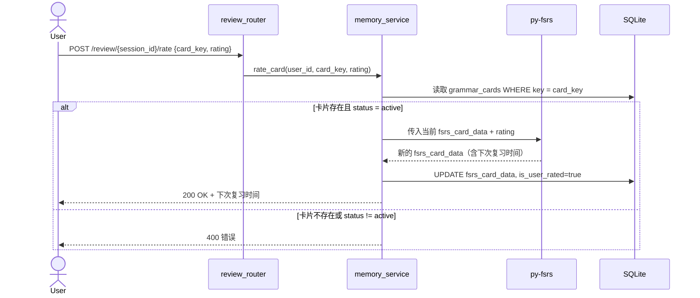
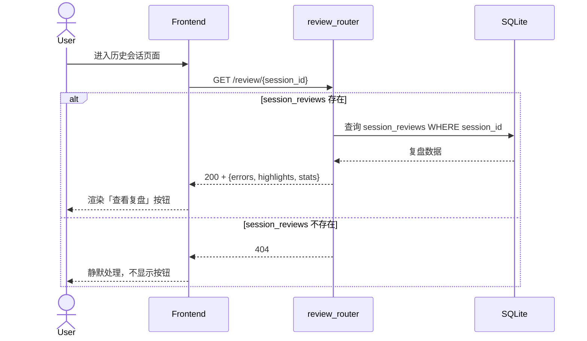

# 记忆调度流程（Memory Flow）

> 描述：FSRS 记忆卡片从创建到复习的完整数据流
> 涉及模块：chat_router · review_service · memory_service · grammar_cards 表
> 最后更新：V0.2b

---

## 一、全局流程概览



---

## 二、卡片状态机



**状态说明**：

| 状态 | 含义 | fsrs_card_data |
|---|---|---|
| `pending` | 刚发现，等待确认是真实问题 | 空字符串 |
| `active` | 已确认，纳入 FSRS 调度 | JSON（含 due_date 等） |
| `deleted` | 用户主动删除 | 保留原值 |

---

## 三、对话阶段：卡片注入流程



**注入逻辑说明**：
- 只注入 `status = 'active'` 的卡片，`pending` 不注入
- 注入上限：最多 10 张（避免 prompt 过长）
- 注入格式：自然语言描述，不暴露"这是错误记录"给用户

---

## 四、复盘阶段：错误分析与卡片更新



---

## 五、评分阶段：FSRS 调度更新



**`is_user_rated` 的作用**：
- `false`（默认）：系统自动触发 FSRS 调度，用较保守的参数
- `true`：用户主动评分，FSRS 使用用户给出的 rating，不再被系统覆盖

---

## 六、历史复盘访问流程



---

## 七、关键数据结构

**grammar_cards 表**：

```
id              INT PK
user_id         TEXT (indexed)
key             TEXT (snake_case，如 "go_went")
content         TEXT (错误描述)
example_wrong   TEXT
example_right   TEXT
explanation_zh  TEXT
frequency       INT  (默认 1)
fsrs_card_data  TEXT (JSON，pending 时为空字符串)
status          TEXT ('pending' | 'active' | 'deleted')
created_at      DATETIME
updated_at      DATETIME
UNIQUE(user_id, key)
```

**session_reviews 表**：

```
id              INT PK
session_id      INT UNIQUE FK → sessions.id
user_id         TEXT
errors          TEXT (JSON Array)
highlights      TEXT (JSON Array)
stats           TEXT (JSON)
is_user_rated   BOOL (默认 False)
created_at      DATETIME
```
