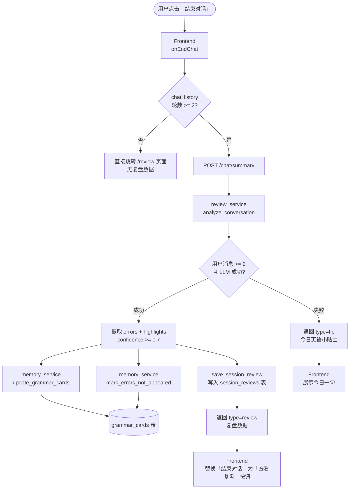
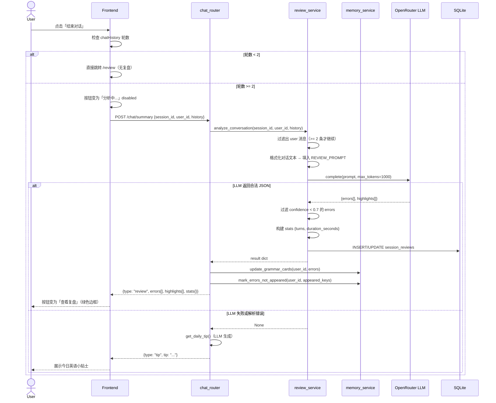
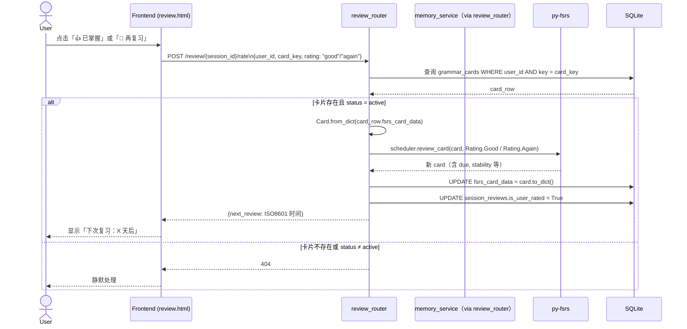
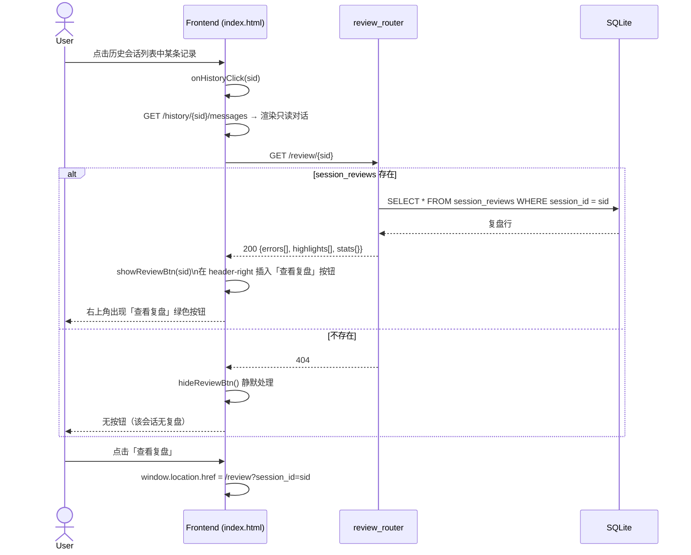

# 对话复盘流程（Review Flow）

> 描述：从用户点击「结束对话」到复盘展示、用户评分、历史访问的完整数据流
> 涉及模块：chat_router · review_service · memory_service · review_router · session_reviews 表 · grammar_cards 表
> 最后更新：V0.2b

---

## 一、全局流程概览



---

## 二、复盘生成时序



---

## 三、复盘 UI 三层结构

```mermaid
flowchart TD
    A([用户进入 /review 页面]) --> B[GET /review/{session_id}]

    B --> C{session_reviews\n记录存在?}
    C -->|否，404| D[展示「暂无复盘数据」]
    C -->|是，200| E[渲染三层卡片]

    E --> F[第一层：统计摘要\nstats.turns · 会话时长]
    E --> G[第二层：语法错误卡片\nerrors[]\n原句 / 建议 / 解释]
    E --> H[第三层：表达亮点\nhighlights[]\n做得好的地方]

    G --> I{卡片 status?}
    I -->|pending| J[显示卡片，无评分按钮]
    I -->|active| K[显示卡片 + 评分按钮\n👍 已掌握 / 🔁 再复习]

    K --> L([用户点击评分])
    L --> M[POST /review/{session_id}/rate]
```

---

## 四、用户评分时序



---

## 五、历史复盘访问时序



---

## 六、LLM 分析结果数据结构

**REVIEW_PROMPT 期望 LLM 返回的 JSON 结构**：

```json
{
  "errors": [
    {
      "key": "go_went",
      "content": "过去时 go 应用 went",
      "original": "I go to the office yesterday",
      "corrected": "I went to the office yesterday",
      "explanation_zh": "go 的过去式是 went",
      "confidence": 0.95
    }
  ],
  "highlights": [
    {
      "quote": "That's a really thoughtful way to put it!",
      "comment": "用了地道的 put it 表达，自然流畅"
    }
  ]
}
```

**过滤规则**：`confidence < 0.7` 的 error 条目在 `review_service` 中被丢弃，不写入数据库。

**`session_reviews` 表存储格式**：

```
errors    TEXT  → JSON.stringify(errors[])     过滤后
highlights TEXT → JSON.stringify(highlights[])
stats      TEXT → JSON.stringify({turns, duration_seconds})
```
