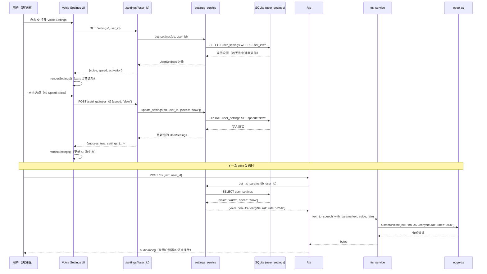
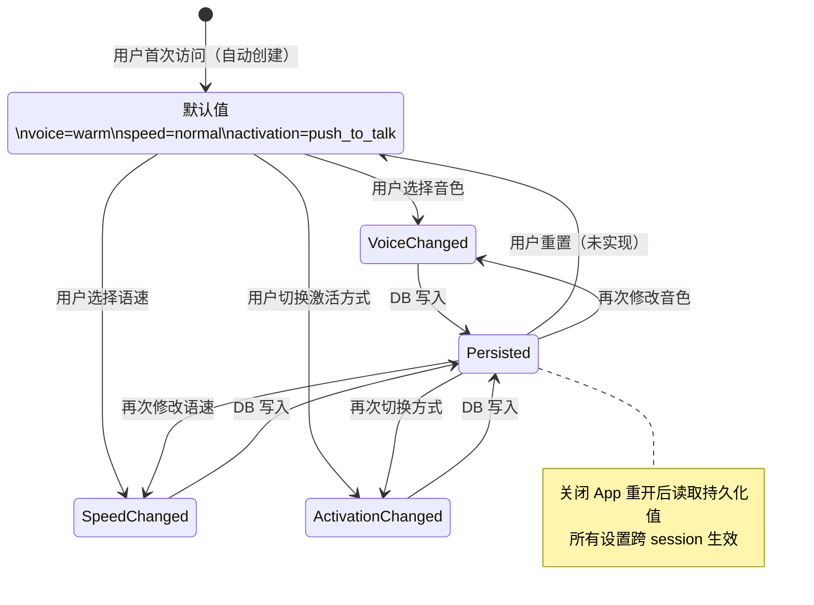

# Settings Flow — 用户设置完整调用链

> 引入版本：V0.3.1
> 覆盖 SPEC：SPEC-01 ~ SPEC-06

---

## 1. 设置保存与 TTS 集成调用链

---

## 2. user_settings 状态图

---

## 3. 映射关系

| 用户选项 | voice_key | edge-tts voice | rate |
|---|---|---|---|
| Warm | warm | en-US-JennyNeural | — |
| Steady | steady | en-US-GuyNeural | — |
| Bright | bright | en-US-AriaNeural | — |
| Slow | — | — | -25% |
| Normal | — | — | +0% |
| Fast | — | — | +25% |
