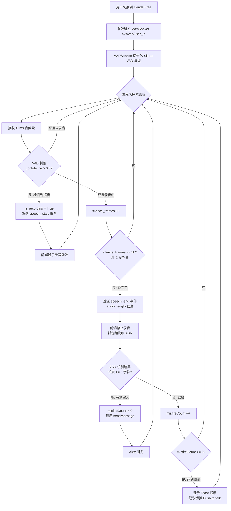
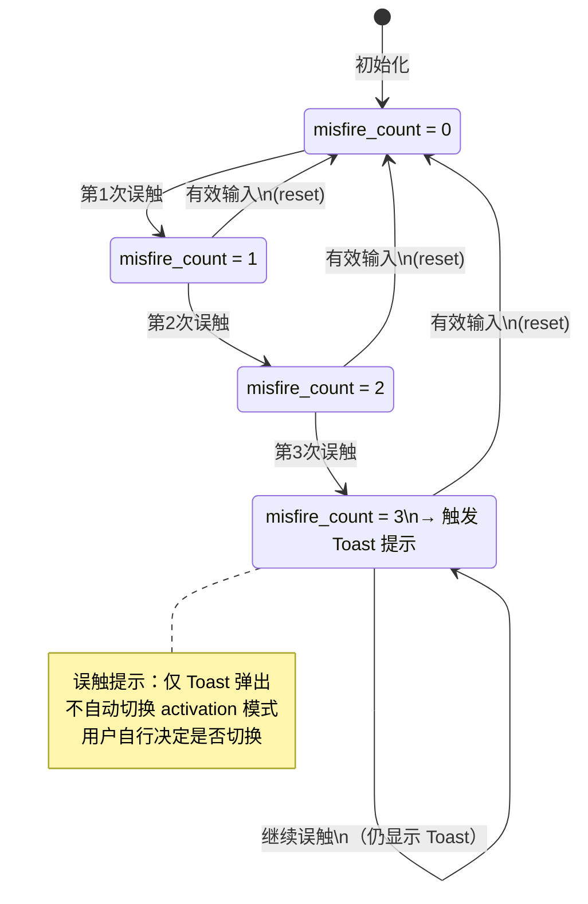

# VAD Flow — 实时语音检测流程

> 引入版本：V0.3.1
> 覆盖 SPEC：SPEC-07 ~ SPEC-11

---

## 1. Hands Free 完整流程

---

## 2. 误触计数状态机

---

## 3. 关键参数

| 参数 | 值 | 说明 |
|---|---|---|
| SAMPLE_RATE | 16000 Hz | Silero VAD 要求 |
| SILENCE_THRESHOLD | 2.0 秒 | 高于常规 1.5 秒，适配英语学习者思考停顿 |
| FRAMES_PER_SECOND | 25 | 每帧 40ms |
| SILENCE_FRAMES | 50 | 2s × 25fps |
| VAD confidence 阈值 | 0.5 | 默认值，平衡误触与漏检 |
| MIN_TRANSCRIPT_LENGTH | 2 字符 | 少于此长度视为误触 |
| MISFIRE_MAX_COUNT | 3 次 | 达到后显示切换提示 |
